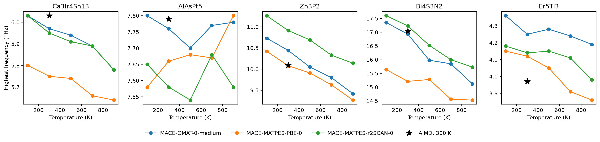
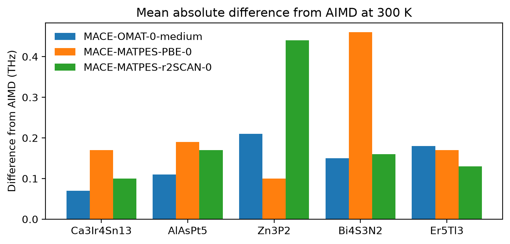
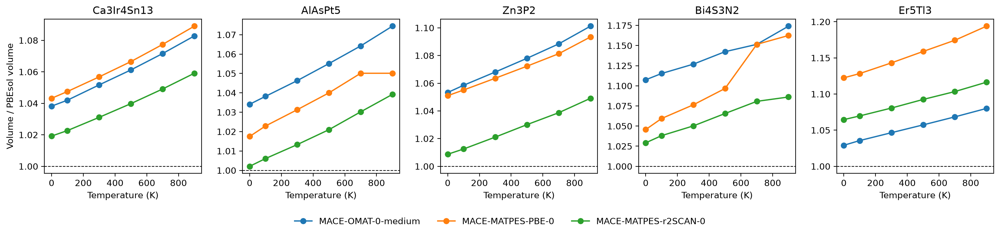
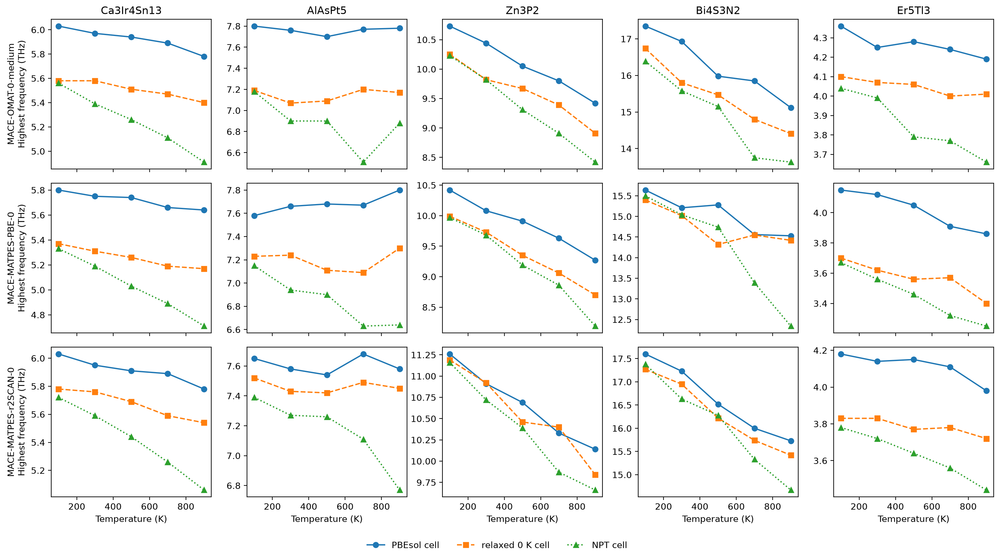
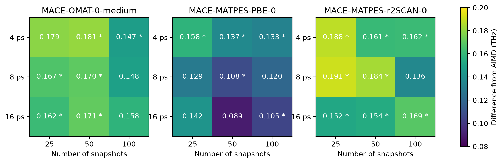

# Finite-temperature phonons from MACE potentials

How well do foundation MACE potentials reproduce phonons at finite temperature?
We fit effective harmonic force constants to MD trajectories from three MACE
potentials and compare them with ab initio MD (AIMD).

## Setup

- The workflow is `ForceFieldFiniteTemperaturePhononMaker` in atomate2
  ([PR #1560](https://github.com/materialsproject/atomate2/pull/1560)). An NVT MD
  of the supercell runs for 8 ps with a 1 fs time step and a Langevin
  thermostat. The first 1 ps is left out. pheasy fits the second-order force
  constants with LASSO to 50 snapshots spread over the rest of the trajectory.
  This follows the temperature-dependent effective potential (TDEP) idea of
  Hellman et al., Phys. Rev. B 84, 180301 (2011).
- The potentials are MACE-OMAT-0-medium, MACE-MATPES-PBE-0 and
  MACE-MATPES-r2SCAN-0, all in float64.
- The five materials come from the Materials Project's Harmonic Phonon
  Database, in its PBEsol cell. Four of them have imaginary modes at 0 K.
  KNaICl is used for the test of the MD settings.
- Each runs at 100, 300, 500, 700 and 900 K.
- The reference is AIMD with PBEsol at 300 K, in the same cell and supercell. The
  AIMD trajectories and force constants are not public yet, so only the summary
  numbers are given here.

| Material | mp-id | Supercell |
|---|---|---|
| Ca3Ir4Sn13 | mp-1200211 | 2x2x2 |
| AlAsPt5 | mp-1025306 | 4x4x2 |
| Zn3P2 | mp-2071 | 2x2x2 |
| Bi4S3N2 | mp-1245549 | 2x2x2 |
| Er5Tl3 | mp-1105965 | 2x2x2 |
| KNaICl | mp-1002081 | 3x3x2 |

Every run used one NVIDIA A100 GPU on NERSC Perlmutter and took 3 to 29 minutes.

## Agreement with AIMD at 300 K

Mean absolute difference from AIMD at 300 K in THz, over all branches and
q-points of the band path.

| Material | OMAT-0-medium | MATPES-PBE-0 | MATPES-r2SCAN-0 | AIMD highest frequency |
|---|---|---|---|---|
| Ca3Ir4Sn13 | **0.07** | 0.17 | 0.10 | 6.03 |
| AlAsPt5 | **0.11** | 0.19 | 0.17 | 7.79 |
| Zn3P2 | 0.21 | **0.10** | 0.44 | 10.09 |
| Bi4S3N2 | **0.15** | 0.46 | 0.16 | 17.03 |
| Er5Tl3 | 0.18 | 0.17 | **0.13** | 3.97 |

- No potential is best for every material. MACE-OMAT-0-medium is closest to
  AIMD for three of the five.
- MACE-MATPES-PBE-0 gives the lowest frequencies for most materials. For
  Bi4S3N2 its highest branches lie about 1.8 THz below AIMD.
- The imaginary modes at 0 K are gone at every temperature for Ca3Ir4Sn13,
  Zn3P2 and Er5Tl3. Bi4S3N2 keeps imaginary modes in 12 of 15 runs. Its AIMD
  reference has a small one as well, at -0.12 THz. Bi4S3N2 is polar, and these
  runs leave out the non-analytical correction, since the three potentials give
  no Born charges. The [MACE-Field study](../mace_field_born_charges) checks a
  model that does.
- By the Lindemann criterion, Zn3P2 melts at 900 K with MACE-OMAT-0-medium and
  MACE-MATPES-PBE-0.

## Thermal expansion

The runs above keep the PBEsol cell at every temperature. We ran all 75
settings again in each potential's own relaxed 0 K cell, and in the cell from
an NPT MD at each temperature.

- The relaxed 0 K cells are up to 12% larger in volume than the PBEsol cell.
  MACE-MATPES-r2SCAN-0 gives the cell closest to PBEsol for four of the five
  materials.
- From 0 to 900 K the volume grows by 3 to 6.5%. Bi4S3N2 with
  MACE-MATPES-PBE-0 grows by 11%.
- At 900 K the NPT cell lowers the highest frequency by 0.15 to 0.8 THz, and by
  2.1 THz for Bi4S3N2 with MACE-MATPES-PBE-0.

## MD length and number of snapshots

KNaICl at 300 K, with 4, 8 and 16 ps of MD and 25, 50 and 100 snapshots. A star
marks a run with imaginary modes on the band path.

The difference from AIMD lies between 0.09 and 0.19 THz and shows no trend with
either setting. It is the noise of a single MD run. 4 ps gave about the same
agreement as 8 and 16 ps.

## Files

- `results.json` holds every number in the figures and tables.
- `plot.py` makes the figures from it.
- The tutorial notebook in atomate2 PR #1560 runs every setting.
