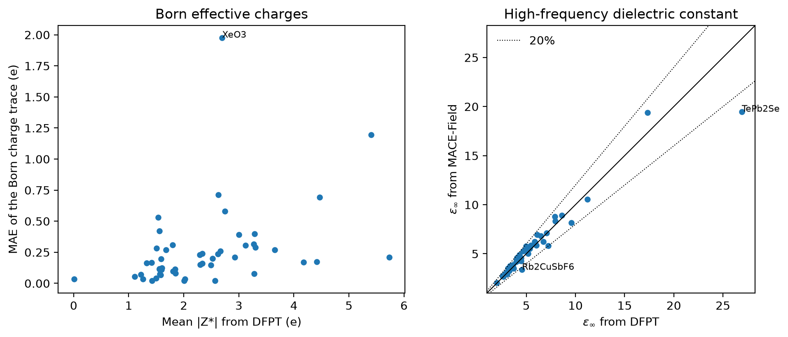

# Born charges and dielectric constants from MACE-Field

Phonons of polar crystals need the Born effective charges and the
high-frequency dielectric tensor for the non-analytical correction. Both
usually come from a DFPT calculation. MACE-Field
([Martin et al., PRX Intelligence 1, 013006 (2026)](https://doi.org/10.1103/b116-xy8k))
predicts them from the structure. Here we check its "mp-dielectric" head
against the DFPT results of the Materials Project's Harmonic Phonon Database.
atomate2 runs this model in its phonon workflows through
`ForceFieldDielectricMaker`
([PR #1573](https://github.com/materialsproject/atomate2/pull/1573)).

## Held-out materials

MACE-Field is trained on the Materials Project dielectric data. To test it on
materials it has not seen, `heldout.py` picks 50 materials from the Harmonic
Phonon Database that have no Materials Project dielectric document. They are
drawn at random, with a fixed seed, from the materials with a band gap above
0.5 eV and up to 20 sites. Each one is computed on the structure of its
database entry.



| Quantity | Error |
|---|---|
| Born charges, per tensor element | 0.145 e (mean absolute) |
| Born charges, trace | 0.26 e (mean absolute), 11% of the mean \|Z*\| of 2.36 e |
| High-frequency dielectric constant | 8.2% mean, 6.6% median |

- The dielectric constant is off by more than 20% for 2 of the 50 materials,
  TePb2Se (19.5 against 26.9) and Rb2CuSbF6 (3.37 against 4.57).
- The largest Born charge error is for XeO3, 2.0 e on the trace.

## Spot check

`spot_check.py` runs NaCl, KCl, MgO, Zn3P2 and Bi4S3N2 with all three heads
of the model. The table gives the "mp-dielectric" head for the three
materials that are in the training data.

| Material | Born charge, MACE-Field / DFPT (e) | Dielectric constant, MACE-Field / DFPT |
|---|---|---|
| NaCl | 1.08 / 1.09 | 2.63 / 2.56 |
| KCl | 1.13 / 1.13 | 2.45 / 2.38 |
| MgO | 1.93 / 1.95 | 3.30 / 3.15 |

The database entry of Zn3P2 is left out. Its dielectric tensor is the identity
and its Born charges have flipped signs.

## Effect on the phonons

For NaCl, the atomate2 phonon workflow with MACE-OMAT-0-medium forces and the
MACE-Field Born charges gives a highest frequency of 7.51 THz. Without the Born
charges it gives 6.49 THz. The atomate2 tests check the first value.

## Reproduce

```
pip install git+https://github.com/mdi-group/mace-field.git@45d5c5fa7b40a155855b3d155df1760e36849e64
pip install mp-api matplotlib
wget https://github.com/mdi-group/mace-field/releases/download/1.0.2/MACEField-MH-0-omat-dielectric.model
export MP_API_KEY=...
python heldout.py MACEField-MH-0-omat-dielectric.model
python spot_check.py MACEField-MH-0-omat-dielectric.model
python plot.py
```

The MACE-Field fork installs as `mace-torch` and replaces MACE. The model file
has the md5 sum `1dac204204e368d94b2b8a597c9fdf8d`. Both scripts run on a CPU.

## Files

- `results/heldout.json` has the errors of each held-out material and the
  materials that were skipped, with the reason.
- `results/spot_check.json` has the spot check, with the Born charge trace of each
  site.
